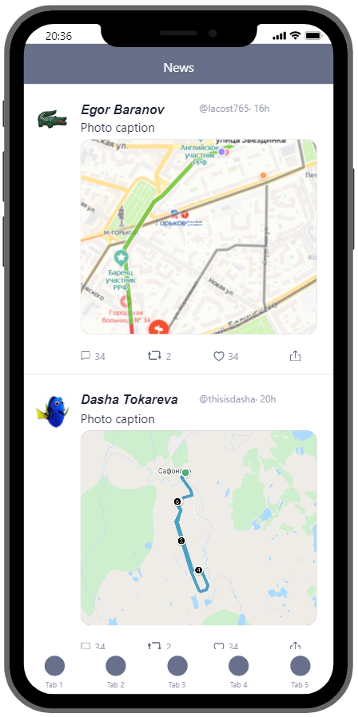

# Vade

Баранов Егор, Токарева Даша

## Описание

Наше приложение представляет собой фитнес-помощника для нескольких видов велосипедных тренировок. В зависимости от выбранного режима тренировки, будет отображаться та или иная информация, специфичная для конкретного велосипедного спорта, также пользователю будет доступная общая информация о тренировке, например отрисованный маршрут с учетом перепада высот, графики отображающие динамику движения, информацию о биологических ритмах и многое другое.

## Функционал

*	Отрисовка маршрута с учетом перепада высот
*	Замеры скорости и темпа
*	Представление измерений в виде графиков
*	Выбор вида велосипедного спорта
*	Специфичные параметры для разных видов тренировок
*	Сбор информации о биологических ритмах с помощью HealthKit
*	Возможность настраивать профиль
*	Лента с информацией о тренировках других пользователей
*	Возможность просматривать свои прошлые тренировки
*	Статистика на основе прошедших тренировок пользователя (например, усредненное значение скорости, частоты тренировок и т.п.)
*	Onboarding при первом входе в приложение
*	Возможность задавать цели

## Экраны

### Загрузка

Экран загрузки появляется при входе в приложение, будет отображать название и логотип.

### Onboarding

Несколько экранов, появляющихся при первом запуске приложения, для знакомства с основным функционалом.

### Авторизация

Процесс создания профиля пользователя. По дефолту юзеру будет предлагаться 3 варианта регистрации: через Google аккаунт, учетную запись VK или через создание нового профиля Vade с привязкой к email.

### Создание профиля Vade

Соответственно, экран создания пользователя Vade. Поля для заполнения: email, username, password.

### Заполнение персональных данных

После создания профиля пользователю будет предложено заполнить персональные данные, например, пол, рост, вес, возраст и тд. Это необходимо для более точного анализа его тренировок.

### Неактивная тренировка

Один из основных экранов приложения. Отображает карту, которая отображает текущее местоположение пользователя. Также отображаются настроки для тренировки, например, предпочитаемый темп, вид спорта и так далее. Очевидно, имеет кнопку типа "Старт" для начала тренировки.

### Активная тренировка

Отображает маршрут пользователя на карте и кнопку "Завершить тренировку". Также на экран выводятся попутные данные, например, текущий темп, пройденное расстояние, средняя скорость и т.п.

### Профиль

Страница профиля, отображает часть персональных данных, а также некоторые собранные статистики (количество тренировок за последний месяц, среднее время тренировки и т.д.). Также имеется кнопка редактирования профиля.

### Последние тренировки

Вкладка с последними тренировками пользователя. Каждая тренировка отображает некоторую информацию о себе, например, длительность, погодные условия, перепад высот и так далее.

### Информация о тренировке

С экрана "Последние тренировки" можно выбрать любую тренировку, чтобы отобразить более детальную информацию о ней.

### Лента

На этом экране должны появляться тренировки пользователя и людей, на которых он подписался. Также, возможно здесь будут появляться спортивные новости по различным тематикам.

### Фокус на записи в ленте

На каждой записи в ленте, будь то новость или чья-то тренировка, можно сделать фокус, чтобы просмотреть более детальную информацию.

### Настройки приложения

Экран настроек приложения. Например, смена языка, доступ к местоположению, смена пользователя, настройка уведомлений и т.д.

